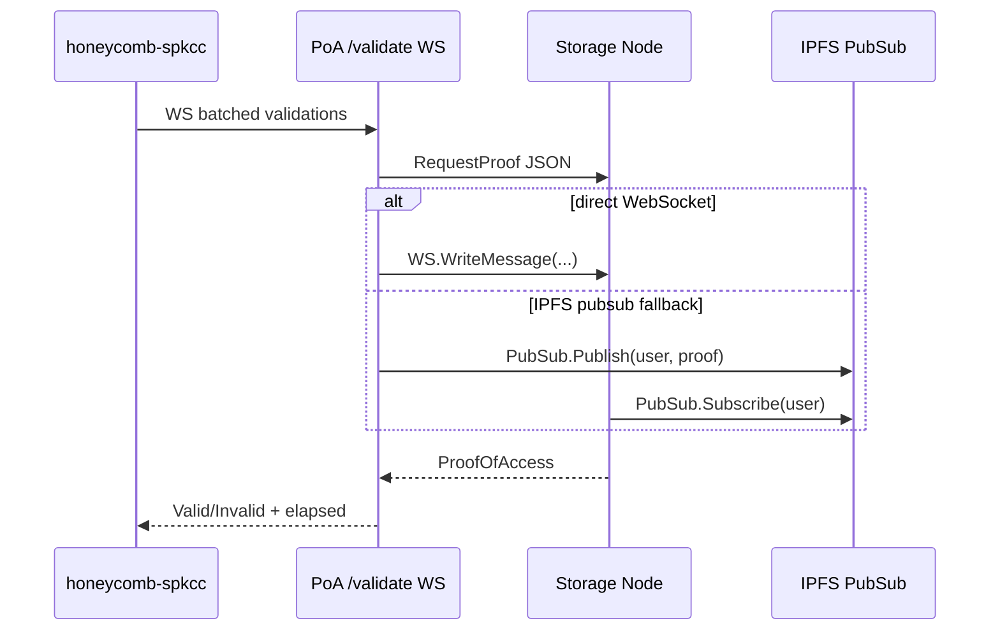
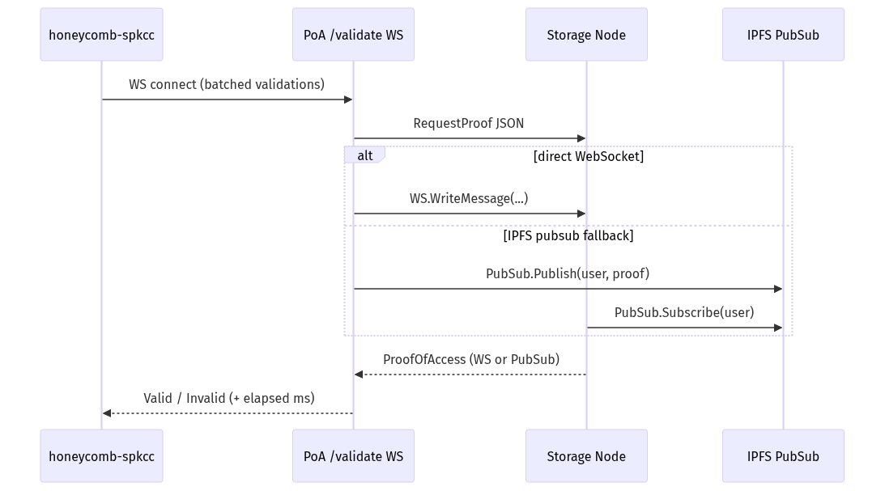

## ProofOfAccess lottery deep-dive (Oratr)

This page summarizes how validations are scheduled and scored, and how the PoA service communicates with storage nodes. See also `dlux-docs/spk/poa-lottery-deep-dive.md` for network-wide context.

### Lottery selection flow
```mermaid
graph TD
  A[New block arrives] --> B[Compute prand]
  B --> C[getPrand58(account, prand)]
  C --> D[range from weights, total_files, vals_target]
  D --> E[gte..lte Base58 window]
  E --> F[match reversed CID prefix in window]
  F --> G[enqueue (Name,CID,SALT,bn)]
  G --> H[batch WS to /validate]
```

### Channels: primary and fallback


### Latency scoring and rewards
```mermaid
graph LR
  A[Latencies per node] --> B[μ, σ]
  B --> C[z = (t-μ)/σ -> 1-char]
  C --> D{|z|<2: r=2; 2≤|z|<3: r=1; else 0}
  D --> E[TROLE bonus may double]
```

Oratr note
- Oratr users running storage nodes benefit from low, stable latency to validators; aim for z within ±2 for full rewards.

### PNG versions

- Lottery selection: 
- Channels: 
- Latency scoring: 
- Lifecycle: 
