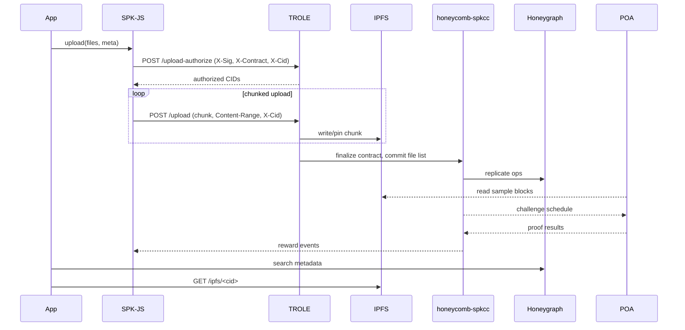
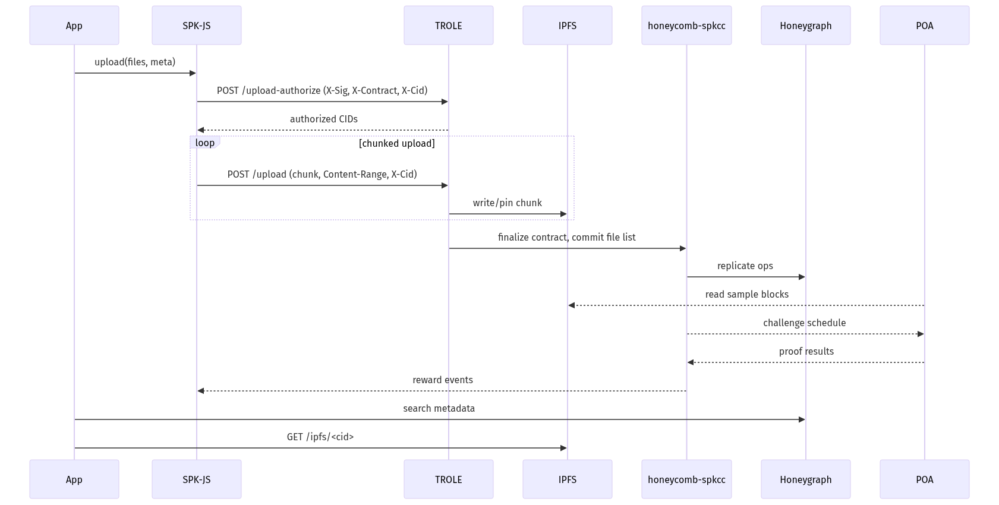

## SPK Network architecture and tokenomics diagrams

These diagrams summarize the services Oratr interacts with when uploading and serving media via the SPK Network.

### High-level interconnections
```mermaid
graph LR
subgraph "Clients"
  A[Oratr (Desktop)]
  B[Web dApps + SDK\n(spk-js)]
end
subgraph "Edge API"
  C[TROLE\n(ipfs.dlux.io)]
end
subgraph "Data Network"
  D[IPFS Network]
  E[ProofOfAccess\n(poa.dlux.io)]
end
subgraph "Chain & Index"
  F[honeycomb-spkcc\n(L2 contracts, tokens)]
  G[Honeygraph\n(Dgraph read API)]
end
A -- authorize, upload cmds --> C
B -- authorize, upload cmds --> C
C -- stream chunks, pin --> D
E <--> D
C -- finalize, record contracts --> F
E -- proof results --> F
F -- replicate ops --> G
A -- queries: files, balances --> G
B -- queries: files, balances --> G
A -- download by CID --> D
B -- download by CID --> D
```

### Upload and retrieval flow


### Tokenomics overview
```mermaid
graph LR
subgraph "Tokens"
  L[LARYNX\n(mining token)]
  B[BROCA\n(resource credits)]
  S[SPK\n(governance & rewards)]
end
subgraph "Actors"
  U[Users & Creators]
  SN[Storage Nodes]
  VN[Validators]
  DAO[DAO Treasury]
end
HC[honeycomb-spkcc\n(L2 token ledgers & rules)]
POA[ProofOfAccess\n(proofs)]

U -- power up --> L
L -- regenerates --> B
U -- consume BROCA\nfor uploads, API --> B
U -- stake / vote --> S
S -- governance: set rates,\nreward weights --> HC
POA -- challenge results --> HC
HC -- rewards (SPK/LARYNX) --> SN
HC -- attestation rewards --> VN
U -- fees (if any) --> DAO
DAO -- grants/incentives --> SN
```

Notes for Oratr users
- Oratr uses `spk-js` under the hood to authorize uploads with TROLE and to query Honeygraph.
- Files are retrieved by CID from IPFS; metadata and balances are fetched from Honeygraph.

### PNG versions

- Overview: 
- Upload flow: 
- Tokenomics: 
